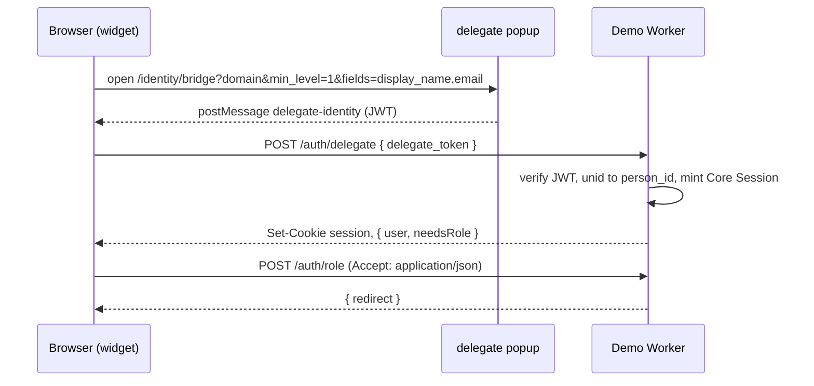
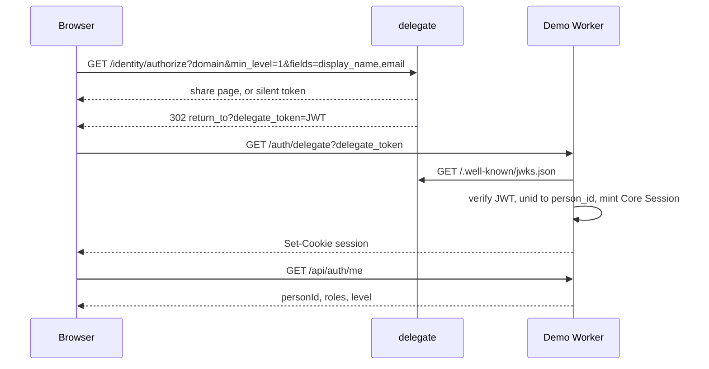

# Festival demo — identity flow

The demo is an Astro + Cloudflare Worker Site that embeds `@engine9/core`
and `@engine9/id`. Protocol: [`id/docs/protocol.md`](../../id/docs/protocol.md).

## How visitors log in

The [`@engine9/id` login widget](../../id/README.md#the-login-widget) in the
header is the main way to interact with Delegate. One **Login** button shows
the session's email and role. Its dialog runs every Delegate step on the
current page: Log in with Google, Switch email, Change role (VIP or Admin),
and Log out. Only the Delegate popup opens a second window.

In-page log in links (Schedule, Tickets, Register, and the notices on
`/login`) carry `data-open-login`; the layout opens the same dialog for them.
Their `href` is the no-JavaScript fallback.

`/login` leads with the same Login button, then the fallback: the full-page
redirect flow, a popup button, a Level 0 probe, and the reason codes when
sign-in fails.

## Roles (example)

**Segment roles** (hard gates) are defined in `src/lib/roles.ts` /
`src/lib/engine9.ts`. Same `requiredAuth` shape as **declared roles** in
[`@engine9/id`](../../id/docs/declared-roles.md) / [`demo-id`](../../demo-id)
— those are soft UI only until you map them to `person_segment`.

- **VIP** — segment `5f2ab45c-0a39-4939-a2af-c1fcc58f37ff`, scopes
  `data:read`, `requiredAuth.minLevel = 1` (shared Level 1 fields are
  enough for lounge personalization).
- **Admin** — segment `4f4ac886-f53d-48e1-b4bd-5a98eb48cc6f`, scopes
  `admin`, `requiredAuth.minLevel = 3` (trusted provider).

`loadRolesOnLogin: false` so every login picks a role: in the widget's Role
section, or on `/choose-role` after a redirect login.

## Requested fields

Login asks delegate for required fields `display_name` and `email`
(`fields` on `/identity/authorize` and on the `@engine9/id` popup).
There are no `optional_fields`.

When a request omits both lists, delegate requires that same pair.
Required fields are locked on the share page. Optional fields, when a
site sends them, are checkboxes. A Grant that already shares every
required field with a value, at `min_level`, issues the token with no
page. Staying anonymous, or declining a required field, keeps
Level 0 (`level_unavailable` when `min_level` is above 0).

## Log in vs. Switch email

The widget's **Log in with Google**, and the fallback **Log in** and **Log
in (popup)** on `/login`, are the same request. The widget and the popup
button use an `@engine9/id` popup; **Log in** takes the page to delegate and
back. All go straight through when the Grant already covers the request.

**Switch email** in the widget (and its redirect fallback **Change your
Delegate information**, `GET /auth/change`, on `/login`) sends the same request with
`prompt=select`. Delegate always
shows the share page, with the person's email addresses to pick from, a link
to add one, and a link to use a different Google account. The new token
replaces this site's session. Picking another address keeps the same Domain
UNID (`sub`), so the site sees the same person. Switching Google accounts
signs in as a different delegate User, so the site sees a different `sub`.

The widget always offers it. Also point to it wherever a signed-in person
could be stuck with the wrong address: the login page (a `data-open-login`
link to the dialog) and login errors (`/auth/change`, which works without a
session). Signing in again does not help them, because delegate goes
straight through with the remembered Grant.

Shareable delegate fields are `display_name`, `given_name`,
`family_name`, `email`, `phone`, and `attributes`. `email_type` is a
site people field. The register form sends it only on
`POST /api/people`.

## People fields

Register and people APIs use `@engine9/schemas` names:
`given_name`, `family_name`, `email`, `email_type` (`Personal` | `Work` |
`Other`). See [`id/docs/forms.md`](../../id/docs/forms.md).

## Sequence (login widget)

Log out starts `POST /auth/logout` and, when the visitor ticks "Also sign
out of Delegate in this browser", the `/identity/logout/bridge` popup in the
same click.

## Sequence (redirect fallback, `/login`)

## Client vs server

- `@engine9/id/widget` in the header (every page): one Login button and
  dialog. Popup login, then `POST /auth/delegate` with `{ delegate_token }`
  (JSON answer, same session cookie). The dialog then offers VIP / Admin
  (`POST /auth/role` with `Accept: application/json`), Switch email, and
  Log out.
- `@engine9/id` fallback on `/login`: Identity Token popup (`requestIdentity`
  with required `display_name` and `email`), Level 0 probe (no fields),
  then `GET /auth/delegate?delegate_token=`.
- Server: JWT verify, person pipeline, HttpOnly `session` cookie,
  middleware for `/vip` and `/admin` (also checks `requiredAuth.minLevel`).
- Level 1 register: `/auth/register` → `POST /api/people` with
  `{ given_name, family_name, email, email_type }` and the seeded
  `e9publickey_` (scope `public` only). The private `e9key_` stays
  server-only for admin-style API calls.

Browser-only on-ramp (no core): [`demo-id`](../../demo-id).

## When sign-in fails after Delegate

Delegate has already sent the Identity Token. The failure is this site
finishing login: install schema plugins, resolve the person, mint the session.
The login page shows the reason code and the database or plugin detail.
Signing in again does not fix a configuration failure.

| Reason | What is happening |
| --- | --- |
| `plugin_registry_missing` | The Worker was deployed without `@engine9/schemas` compiled in. `e9core build-plugins` must run, and `@engine9/core/plugins/site` must alias `engine9.plugins.js`. |
| `schema_update_failed` | Installing schema plugins tried to add a column with `DEFAULT CURRENT_TIMESTAMP`. D1 rejects that `ALTER TABLE`. The table has to be rebuilt. |
| `database_error` | D1 rejected some other statement. The detail is the SQL error. |
| `missing_session_secret` | `SESSION_SECRET` is not set on the Worker. |
| `invalid_identity_token` | The token did not verify. Sign in again. |

The same table is in [`core` deploy docs](../../core/docs/deploy.md#when-sign-in-fails-after-delegate).
